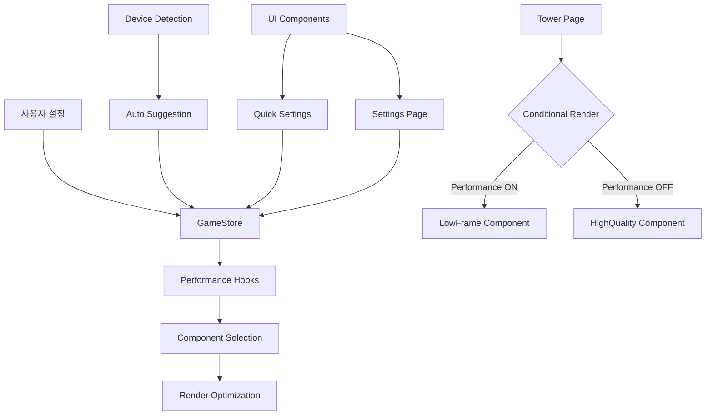

# 🏗️ 성능 최적화 아키텍처 문서

## 📋 시스템 개요

Infinity Othello의 성능 최적화 시스템은 계층화된 아키텍처를 통해 사용자 경험을 최적화합니다. 상태 관리, 컴포넌트 선택, 렌더링 최적화가 유기적으로 연결되어 동작합니다.

## 🎯 아키텍처 다이어그램



## 🔧 핵심 아키텍처 컴포넌트

### 1. 상태 관리 계층 (State Management Layer)

#### GameStore (Zustand)
```typescript
interface GameState {
  ui: {
    performanceMode: boolean;    // 성능 모드 상태
    animations: boolean;         // 애니메이션 상태
    soundEnabled: boolean;       // 사운드 상태
  };
}
```

**역할**:
- 전역 성능 설정 상태 관리
- 컴포넌트 간 상태 동기화
- 지속성 저장 (localStorage)

### 2. 성능 감지 계층 (Performance Detection Layer)

#### Device Performance Detection
```typescript
interface DeviceInfo {
  isLowEnd: boolean;
  memoryGB: number;
  cores: number;
  gpuTier: 'low' | 'medium' | 'high' | 'unknown';
}
```

**감지 로직**:
- **메모리**: `performance.memory.jsHeapSizeLimit`
- **CPU**: `navigator.hardwareConcurrency`
- **GPU**: WebGL 렌더러 정보 분석
- **브라우저**: User Agent 패턴 매칭

### 3. 최적화 훅 계층 (Optimization Hooks Layer)

#### usePerformanceOptimizations
```typescript
const {
  deviceInfo,
  suggestOptimizations,
  togglePerformanceMode,
  applyAutoOptimizations,
  isPerformanceMode
} = usePerformanceOptimizations();
```

#### useOptimizedAnimationFrame
```typescript
// 성능 모드에 따른 프레임 레이트 조절
const targetFPS = ui.performanceMode ? 30 : 60;
```

#### useOptimizedParticleCount
```typescript
// 파티클 수 최적화
return ui.performanceMode ? Math.floor(baseCount * 0.3) : baseCount;
```

#### useOptimizedCanvasResolution
```typescript
// 캔버스 해상도 최적화
const maxDPR = ui.performanceMode ? 1.0 : 2.0;
```

### 4. 컴포넌트 선택 계층 (Component Selection Layer)

#### 조건부 렌더링 패턴
```typescript
// 타워 페이지에서의 컴포넌트 선택
{ui.performanceMode ? (
  <CinematicHologramTowerLowFrame
    currentFloor={currentFloor}
    maxFloor={maxFloor}
    className="mx-auto"
  />
) : (
  <CinematicHologramTower
    currentFloor={currentFloor}
    maxFloor={maxFloor}
    className="mx-auto"
  />
)}
```

### 5. 렌더링 최적화 계층 (Rendering Optimization Layer)

#### CinematicHologramTowerLowFrame 최적화
- **DPR 상한**: 1.5로 제한
- **오프스크린 레이어**: 8~12fps로 갱신
- **파티클 최적화**: shadowBlur 제거, 스프라이트 캐시
- **격자 밀도**: 축소
- **홀로그램 노이즈**: 30fps 토글

## 🔄 데이터 흐름

### 1. 사용자 설정 변경 흐름
```
사용자 클릭 → UI 컴포넌트 → GameStore 업데이트 → 
성능 훅 반응 → 컴포넌트 리렌더링 → 최적화 적용
```

### 2. 자동 감지 흐름
```
앱 시작 → 디바이스 감지 → 성능 분석 → 
저성능 판단 → 자동 제안 → 사용자 선택 → 최적화 적용
```

### 3. 컴포넌트 선택 흐름
```
성능 모드 상태 → 조건부 렌더링 → 
최적화된 컴포넌트 선택 → 렌더링 최적화 적용
```

## 🎨 UI 아키텍처

### 1. 더보기 페이지 (Quick Settings)
```typescript
// 빠른 설정 토글
<div onClick={() => {
  const { updateUISettings } = useGameStore.getState();
  updateUISettings({ performanceMode: !ui.performanceMode });
}}>
  <span>애니메이션 최적화</span>
  <ToggleButton isActive={ui.performanceMode} />
</div>
```

### 2. 환경 설정 페이지 (Detailed Settings)
```typescript
// 상세 설정 및 성능 정보
<PerformanceSettingsSection>
  <PerformanceModeToggle />
  <DeviceInfoDisplay />
  <AutoOptimizationSuggestion />
</PerformanceSettingsSection>
```

### 3. 타워 페이지 (Conditional Rendering)
```typescript
// 성능 모드에 따른 컴포넌트 선택
<PerformanceAwareTowerComponent />
```

## 📊 성능 지표 및 모니터링

### 1. 성능 지표 수집
```typescript
interface PerformanceMetrics {
  frameRate: number;        // 실제 프레임 레이트
  renderTime: number;       // 렌더링 시간
  memoryUsage: number;      // 메모리 사용량
  batteryLevel?: number;    // 배터리 레벨 (모바일)
}
```

### 2. 성능 모니터링 훅
```typescript
const usePerformanceMonitoring = () => {
  const [metrics, setMetrics] = useState<PerformanceMetrics>();
  
  useEffect(() => {
    // 성능 지표 수집 로직
    const collectMetrics = () => {
      // 프레임 레이트 측정
      // 렌더링 시간 측정
      // 메모리 사용량 측정
    };
    
    const interval = setInterval(collectMetrics, 1000);
    return () => clearInterval(interval);
  }, []);
  
  return metrics;
};
```

## 🔧 확장성 고려사항

### 1. 새로운 최적화 추가
```typescript
// 새로운 최적화 훅 추가
export function useOptimizedTextureQuality(baseQuality: string): string {
  const { ui } = useGameStore();
  return ui.performanceMode ? 'low' : baseQuality;
}
```

### 2. 컴포넌트 최적화 확장
```typescript
// 새로운 최적화된 컴포넌트 추가
const OptimizedComponent = ui.performanceMode 
  ? LowPerformanceComponent 
  : HighPerformanceComponent;
```

### 3. 성능 프로필 시스템
```typescript
interface PerformanceProfile {
  name: string;
  settings: {
    frameRate: number;
    particleCount: number;
    canvasDPR: number;
    textureQuality: string;
  };
}

const profiles: PerformanceProfile[] = [
  { name: 'ultra', settings: { frameRate: 60, particleCount: 100, canvasDPR: 2.0, textureQuality: 'high' }},
  { name: 'high', settings: { frameRate: 60, particleCount: 70, canvasDPR: 1.5, textureQuality: 'medium' }},
  { name: 'medium', settings: { frameRate: 30, particleCount: 50, canvasDPR: 1.0, textureQuality: 'low' }},
  { name: 'low', settings: { frameRate: 30, particleCount: 30, canvasDPR: 1.0, textureQuality: 'low' }},
];
```

## 🚀 성능 최적화 전략

### 1. 렌더링 최적화
- **Canvas 최적화**: DPR 제한, 오프스크린 렌더링
- **애니메이션 최적화**: 프레임 레이트 조절, 파티클 수 감소
- **메모리 최적화**: 스프라이트 캐시, 불필요한 객체 제거

### 2. 상태 관리 최적화
- **선택적 구독**: 필요한 상태만 구독
- **배치 업데이트**: 여러 상태 변경을 배치로 처리
- **메모이제이션**: 계산 비용이 높은 값 캐싱

### 3. 컴포넌트 최적화
- **조건부 렌더링**: 성능 모드에 따른 컴포넌트 선택
- **지연 로딩**: 필요할 때만 컴포넌트 로드
- **가상화**: 대량 데이터 처리 시 가상 스크롤링

## 🔗 관련 문서

[📎 관련 문서: features/performance-optimization-docs.md]
[📎 관련 문서: dev/performance-guide-docs.md]
[📎 관련 문서: architecture/system-architecture-docs.md]

## 📝 변경 이력

- **2025-09-24**: 초기 아키텍처 문서 작성
- **2025-09-24**: 성능 최적화 시스템 설계 완료
- **2025-09-24**: 컴포넌트 선택 계층 구현
- **2025-09-24**: 렌더링 최적화 계층 구현

---

**문서 레벨**: Guide (참조용 가이드)
**최종 검토**: 2025-09-24
**다음 검토 예정**: 2025-10-24
